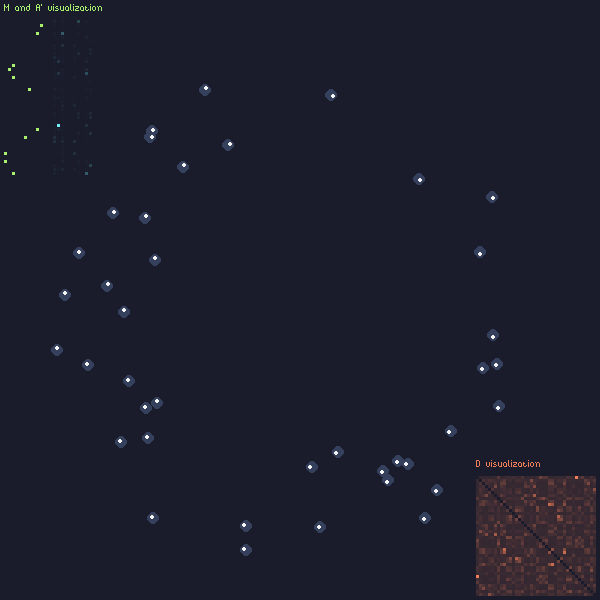

# Particle Swarm Network Simulator



This is a toy network simulator, measuring raw broadcast throughput on the physical layer.

It has a number of assumptions and simplifications! The results are not immediately useful for research. For more details, see `report.md` or `report.pdf`.

## Usage

This project uses Python 3.7+, `numpy`, `pygame`

```
    usage: main.py [-h] [--width WIDTH] [--height HEIGHT] [--nodes NODES]
                [--channels CHANNELS] [--totaltime TOTALTIME] [--fps FPS]
                [--simple] [--font FONT] [--noratelimit]

    optional arguments:
    -h, --help            show this help message and exit
    --width WIDTH, -scrw WIDTH
                            Integer argument.
    --height HEIGHT, -scrh HEIGHT
                            Integer argument.
    --nodes NODES, -n NODES
                            Total number of nodes to simulate
    --channels CHANNELS, -k CHANNELS
                            Total number of channels to simulate
    --totaltime TOTALTIME, -t TOTALTIME
                            Total number of seconds to simulate
    --fps FPS, -f FPS     Frames per second (simulated and rendered)
    --simple, -s          Simplify the rendering to only show particles
    --font FONT           Font to use when rendering.
    --noratelimit         Render faster than FPS
```

## Attribution and License

This project uses [the BitPotion font by Joeb Rogers](https://joebrogers.itch.io/bitpotion) ([CC-BY](https://creativecommons.org/licenses/by/4.0/)) and the [SWEETIE-16 palette by GrafxKid](https://lospec.com/palette-list/sweetie-16).

This code is copyright Lynn Pepin, 'lynndotpy'. It is unlicensed, which technically means you can't use it, but practically speaking, it's just because I haven't chosen one yet. Contact me if you want to use this for something commercial!