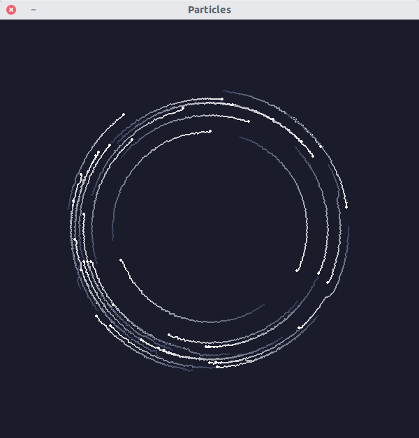
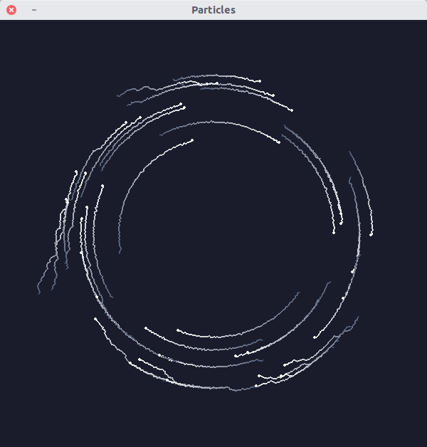
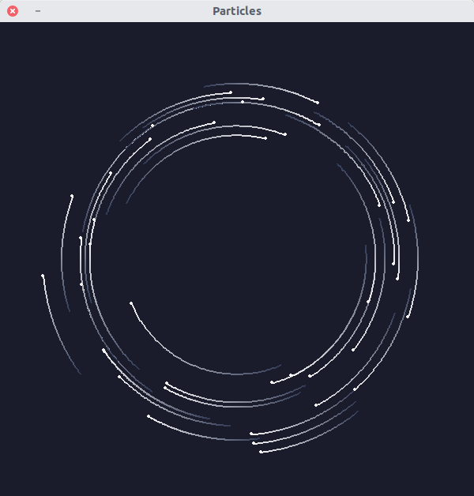

# Final report: Particle swarm network simulation

| | |
|-|-|
| **Course**     | Modeling Abstractions for Embedded/Networked Systems (CSE5309) |
| **Instructor** | Fei Miao
| **Date**       | Spring 2022
| **Student**    | Lynn Pepin
| **NetID**      | tmp13009, 2079724
| **Due:**       | May 7th

# Basic functionality

The goal of this project is to create the foundations for an advanced network simulator. This work makes many (intended!) ommissions and simplifications, using a modularity approach combining entity/component/scene composition and functional programming.

This project simulates a discrete-time network wireless physical-level mesh network. The goal is to measure network throughput in the presence of congestion for different collision-avoidance mechanisms. The network consists of $N$ particles in a swarm communicating over $k$ wireless channels.

This simulation is implemented primarily using Python3, numpy, and PyGame[^pygame], the latter of which is used for rendering the simulation.

[^pygame]: https://www.pygame.org/

As stated, the entity/component/scene system is applied with functional programming to increase modularity:

- The **Entity Component Scene** pattern:
 - Each `Node` is an entity representing a particle with components such as the game screen or messages.
 - A `Swarm` manages the movement of these Nodes, passing the same components as Node,  functional patterns.
 - The `Spectrum` simulates the passing of messages in a wireless spectrum.
 - Components include the virtual screen used for rendering, channels, and messages.
 - One whole simulation is one scene.
 - **Functional patterns** are used to make the code re-usable, allowing the logic of one entity to be modified without requiring large structural changes. For example,
  - Rendering transformations are passed to entities as 

 - The Scene is the PyGame main loop, and while these can be modularly composed
 - The PyGame loop instantiates one Swarm, which has one Spectrum class and many Nodes.
 - The Node and the Spectrum interact 
 - The Swarm defines the physics controlling the nodes and handles the logic

# Model description

- Main challenges in system design
- How solved
- Other existing models

# Appendix A: Table of notation

|||
|-|-|
| $(r, \theta)$ | Polar coordinates, (meters, radians)
| (x, y)      | Cartesian coordinates, meters
| $n \in N$   | Node index
| $k \in K$   | Channel index
| $t$         | Time in seconds
| $\Delta t$  | Simulation timestep
| $d_{ij}$    | Distance between nodes $i$ and $j$ at a gigven timestep.
| $m_{nk}$    | Indicator function if node $n$ communicates on channel $k$.
| $I_{ijk}$   | Absolute intensity received by $i$ of message from $j$ over $k$. 
| | $= m_{jk}\sqrt{d}_{ij}$
| $I'_{ijk}$ | Relative intensity received by $i$ of message from $j$ over $k$. 

Timesteps $t$ are often omitted when notation is only used in calculations that have no dependencies between timesteps (such as distance $d_{ij}$).

<!-- The goal of this system is to simulate the physical layer of a wireless mesh network in order to measure its raw throughput. The network is composed of $N$ nodes, operating as a swarm

This system simulates the motion of $N$ massless particles, communicating over a wireless system with $K$ channels -->

<!-- # Appendix A: Signals and bits

We want to simulate a raw wireless physical layer and measure the throughput in bits. This means no error-correction. We use a simplified formula for loss:[^pathloss]

$$L = 20 \log_{10}\left(4\pi d \lambda^{-1}\right)$$

where $d$ is in meters and $\lambda = 6\cdot10^{9}\text{Hz} = 6\text{GHz}$.

[^pathloss]: Path loss details are succinctly explained at https://en.wikipedia.org/wiki/Path_loss

Signal attenuation is roughly modeled by $I = e^{-a\cdot d}$, where $I$ is the signal intensity ratio, $a$ is a coefficient, and $d$ is distance (in meters for our purpose). We use this intenisty, $I$ (which ranges from 1 to 0) as the probability a single bit is lost to noise.

There are *very very many* constants one needs to derive or source, many of which are not open knowledge as 6GHz WiFi is very new. Relevant constants include 6GHz background noise levels and attenuation rate through different mediums. 

 We assume an attenuation of roughly 50 dB per meter (https://www.extremenetworks.com/extreme-networks-blog/how-far-will-wi-fi-6e-travel-in-6-ghz/, https://www.nctatechnicalpapers.com/Paper/2019/2019-the-promise-of-wifi-in-the-6-ghz-band/download). This means --->

# Appendix B: Particle movement patterns

> **TLDR:** The particles move in a spiral with several local optimum per radius. The particles are then perturbed by adding Gaussian noise, allowing them to "jump" to other local optimum.

{ width=200px }

The $N$ particles are initialized at random at radius $\mathcal{N}(\mu=200,\sigma=30)$ and angle uniform $\mathcal{U}(2\pi)$ from center. The particles do not collide with one another and obey basic Newtonian physics.

First, the particles move according to a system of differential equations, where $(r, \theta)$ are polar coordinates (with the usual transform to Cartesian $(x, y)$ coordiates in $\mathbb{R}^2$):

$$\frac{d\theta}{dt} = \frac{a_1}{r^2}$$

$$\frac{dr}{dt} = \frac{R-r}{R} + a_2 \text{cos}\left(a_3r\right)$$

Here, $R, a_1, a_2, a_3$ are constants. This series of equations defines a system in which particles rotate at radius $R$ around center $(0, 0)$, with rotational speed proportional to $\frac{\pi}{r^2}$. The term $\frac{R-r}{R}$ yields local optimum around $r = R$, but the term $a_2\cdot \text{cos}\left(a_3\cdot r\right)$ adds local optimum "lanes" around $R$. In this manner, we get an interesting spread of particles.

We set $R=100$ is the radius around which the particles rotate, $a_1 = 20000$ to control the rate of rotation. The combination of $a_2 = \frac{3}{2}$ and $a_3 = \frac{pi}{3}$ yield a nice spread of locally-minimum "lanes" around which particles can fall into.

The radius is then perturbed by $\mathcal{N}\left(0, \frac{1}{2}\right)$. This added noise allows particles to 'jump' lanes.

{ width=200px }

{ width=200px }

The motion of recently-initialized particles is shown in Fig \ref{particles_init}, where distant particles quickly move toward the $r=R$ center, moving as shown in Fig \ref{particles_normal}. Note the trails showing how particles 'jump' to different optimum due to added noise.

Particle trails without noise are seen in Fig \ref{particles_nonoise}. Note the smoother motion and the lack of 'jumps'.

# Appendix C: Physical layer contention modeling

We want to simulate a raw wireless physical layer and measure the throughput in bits. This means no error-correction or other signalimprovements. The biggest difficulty here is contention, that is, destructive interference when multiple nodes are talking over the same channel.

We make significant assumptions here, primarily that: 

1. there is no cross-talk between channels,
2. there is no background interference and no scattering / absorption from objects the environment,
3. and messages start, finish, and are received in only one timestep,
4. Messages all contain different content and are of the same length,
5. Destruction is identified in the same timestep as a message is received.

So, the only contention that can happen is when two channels talk at the same time. That is, for a receiver receiving signals simueltaneously from $J$ nodes $n_1, n_2, ..., n_j$, with distances $d_1, d_2, ..., d_J$, which will be the dominant message?

We assume no significant signal attenuation the medium and no beamforming, so signals are only degraded per the square root law. Let $d_{ij}$ denote the distance between nodes $i$ and $j$, and $m_{jk}$ indicate if a node $j$ is broadcasting a message on node $k$. So, a given node $i$ will see the intensity $I_{ijk}$ from node $j$ as $\sqrt{d}_{ij}m_{jk}$. So, the relative intensity of a message from the perspective $i$ of node $j$ broadcasting on channel $k$ is given as 

$$I'_{ijk} = \frac{I_{ijk}}{\sum_{n=1}^N I_{njk}} = \frac{\sqrt{d_{ij}}m_{jk}}{ \sum_{n=1}^N \sqrt{d_{in}}m_{nk}}$$

This can be accelerated with matrix multiplications, representing matrices and messages as matrices and performing $\sqrt{\cdot}$ elementwise. 

We assume a message is constructively received by node $i$ from $j$ over $k$ iff $I'_{ijk} \geq \frac{1}{2}$.

<!-- So, a given signal from node $j$ will have intensity $d_i^{-2}$ in the perspective of the receiver. So, for a given node $j' \in \{1, J\}$, its relative power from a receivers point of view, compared to each other node, is denoted as $$\frac{d_{j'}^{-2}}{d_{j'}^{-2} - \sum_{i=1}^J {d_j'^{-2}}} = 1 - \left(\sum_{i=1}^J {d_j^{-2}}\right)^{-1}$$ -->

<!-- Signal loss can be modeled as $e^{ad}$, where $a$ is some constant and $d$ is the distance. We let the ratio between signal-levels be the measurement of strength. We can assume only destructive (since constructive interference would be very unlikely for any significantly long message.)

So, for a given node $j' \in \{1, J\}$, its relative power from a receivers point of view, compared to each other node, is denoted as $$\frac{e^{ad_{J'}}}{e^{ad_{J'} = \sum_{i=1}^Je^{d_{i}}}.$$

Here, $a$ controls attenuation. For very small $a$, attenuation will be nearly linear with distance --->

