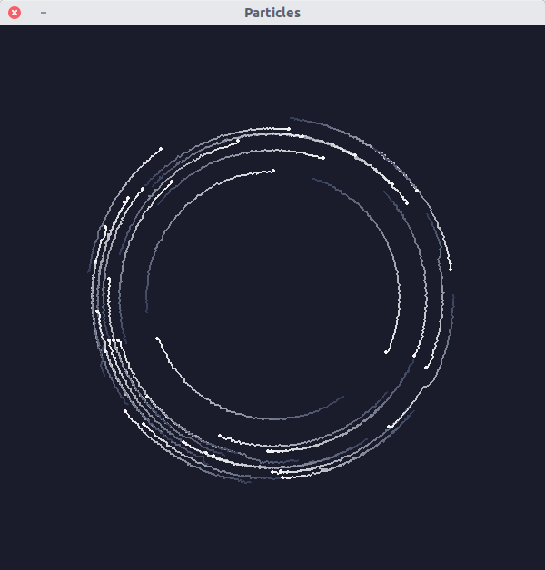
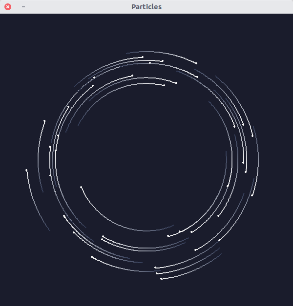

# Final report: Particle swarm network simulation

| | |
|-|-|
| **Course**     | Modeling Abstractions for Embedded/Networked Systems (CSE5309) |
| **Instructor** | Fei Miao
| **Date**       | Spring 2022
| **Student**    | Lynn Pepin
| **NetID**      | tmp13009, 2079724
| **Due:**       | May 7th

# Basic functionality

The goal of this project is to create an advanced particle swam network simulator. This work makes many (intended!) ommissions and simplifications, using a modularity approach combining entity/component/scene composition and functional programming.

This project simulates a discrete-time network wireless physical-level mesh network. The goal is to measure network throughput in the presence of congestion for different collision-avoidance mechanisms. The network consists of $N$ particle in a swarm communicating over $k$ wireless channels. This simulation is implemented primarily using Python3, numpy, and PyGame[^pygame], the latter of which is used for rendering the simulation.

[^pygame]: PyGame main site: https://www.pygame.org/


# Model description

{ width=240px }

This simulator is composed of three primary parts. They are described in detail in Appendix A (Notation), Appendix B (Partical movement physics), and Appendix C (Physical layer network model).

The simulator is visualized in Figure~\ref{screenshot}. In short, these $N$ particles rotate according to a noisy series of differential equations in polar coordinate. On these fixed paths, they communicate over $K$ wireless channels. Signals are greatly simplified such that their intensity only follows the inverse square law. This simplification allows us to perform a wireless network simulation far faster than traditional means, since wave dynamics are not considered. Simulating these network dynamics was the greatest difficulty.

This simulator only measures the physical-layer level throughput, so no mechanisms such as collision-detection/collision-avoidance, exponential backoff, buffering, or ECC are used. Specifically, this simulator measures only **broadcast throughput**. That is, we measure

$$\text{Throughput} = \frac{\text{Messages received}}{(N-1)\cdot\text{Messages sent}}$$

Note the $N-1$ term: This is because one message can be received by all other $N-1$ nodes. 


## Design Principles 

The design of this system is unique. While obstensibly object-oriented, this simulation is modeled as an Entity-Component System[^ecs] and strives to maximize the use of functional[^functional] components and patterns. This makes this simulator code an excellent foundation for further experiments.

Because functional patterns are used so extensively, this makes the code unit testable despite being OoP and ECS heavy. Tests are available in `tests.py`.

[^ecs]: ECS is a common software pattern for game dev and simulation design. Wikipedia offers a succinct summary with good further reading: https://en.wikipedia.org/wiki/Entity_component_system

[^functional]: Here, *functional* refers to the *functional programming paradigm.* Functional paradigms have a multitude of advantages for code readability, testibility, composability, and modularity. 

\newpage
### ECS-Functional Example

For example, each particle *entity* moves according to a system of differential equations  $\left(\frac{dr}{\Delta t}, \frac{d\theta}{\Delta t}\right)$. These equations (and their parameters) are individual *entities*.

A traditional object-oriented approach might have the particle defined as follows:

```
class Node:
    ...
    def update(self):
        dr = (100 - self.r)/100
        dtheta = (20000 / self.r ** 2)
        self.r += dr
        self.theta += dtheta
```

Here, changing the functionality of `Node.update(...)` would require subclassing. Instead, we consider `dr` and `dtheta` *as functional components*:

```
class Node:
    ...
    def update(
        self,
        dr = lambda r: (100 - self.r)/100
        dtheta = lambda r: dtheta = (20000 / self.r ** 2)
    ):
        self.r += dr(self.dr)
        self.theta += dtheta(self.dtheta)
```

Compare this example code to the implementation in `toolkit.py`. The functionality of `Node` can be updated without subclassing. This approach is used throughout the codebase.

The primary value of this approach is that it reduces dependence between components. That is to say, `Node` can be changed without requiring large structural changes. This has permitted rapid unit-test driven development[^tdd] and very quick simulated changes.

[^tdd]: Test-driven development counterintuitively requires tests to be written *before* code. In practice, this allows for rapid development, quick error detection, and well-structured code. It also lends itself well to this functional approach!

## Architecture

The architecture of this code is surmised in `README.md` as follows:

    ```
    ├── assets
    │   │ Contains the one font used in this game.
    │   │
    │   └── BitPotion.ttf
    │
    ├── main.py
    │     Contains the `main()` loop and the argument parser.
    │
    ├── palette.py
    │     Contains code for dealing with colors.
    │     Specifically, GrafxKid's 'Sweetie16' colors palette.
    │
    ├── toolkit.py
    │     Contain the main functionality. Includes Node and Swarm.
    │ 
    └─── tests.py
           Contains unit tests and sanity checks.
    ```

An abbreviated UML diagram is as follows:


\newpage
# Appendix A: Tables of notation {#sec:appendix_notation}

## General simulation notation:

|||
|-|-|
| $(r, \theta)$ | Polar coordinates, (meters, radians)
| (x, y)      | Cartesian coordinates (meters, meters)
| $n \in N$   | Node index
| $k \in K$   | Channel index
| $t$         | Time (seconds)
| $\Delta t$  | Simulation timestep (seconds) 

We omit timestep $t$ in calculations which have no dependency between timesteps (which is most of them).

## Notation used in network simulation:

|||
|-|-|
| $d_{ij}$    | Distance between nodes $i$ and $j$. |
| $m_{jk}$    | Indicator if node $j$ communicates on channel $k$. |
| $a_{i,j,k}$ | Portion node $i$ perceives from $j$ on channel $k$.
| | $= d^{-2}_{ij}m_{jk}$, with unit $\left(\frac{W}{m^2}\right)$ |
| $a'_{i,k}$ | Total intensity node $i$ perceives on channel $k$.
| | $= \sum_{j=1}^n d^{-2}_{ij}m_{jk}$ with unit $\left(\frac{W}{m^2}\right)$ |

## Notation used in network simulation (matrices):

These matrices are not used in this paper, but are used in the implementation and are worth describing.

|||
|-|-|
| $D \in \mathbb{R}^{i, j}$ | Inverse-square distance matrix. |
| | Let $D_{i,j} = d^{-2}_{i,j}$ |
| $M \in \{0,1\}^{i \times j}$ | Message indicator matrix. |
| $A \in \mathbb{R}^{i, j, k}$ | Node-node-channel intensity tensor.
| | $A_{ijk} = D_{ij}M_{jk}$ as Einstein-Summation.[^einsum]
| | Equivalently `np.einsum('ij,jk->ijk', D, M)`
| $A'  \in \mathbb{R}^{i, k}$  | Node-channel intensity matrix.
| | $= D_{ij}\times M_{jk}$.

[^einsum]: Einstein-Summation notation is described succinctly here: https://rockt.github.io/2018/04/30/einsum


\newpage
# Appendix B: Particle movement patterns {#sec:appendix_physical}

> **TLDR:** The particles move in a circle with several "lanes". The particles are then perturbed by adding Gaussian noise, allowing them to "jump" to other lanes.

{ width=200px }


The $N$ particles are initialized at random at radius $\mathcal{N}(\mu=200,\sigma=30)$ and angle uniform $\mathcal{U}(2\pi)$ from center. The particles do not collide with one.

Primarily, the particles move according to a system of differential equations, where $(r, \theta)$ are polar coordinates (with the usual transform to Cartesian $(x, y)$ coordiates in $\mathbb{R}^2$):

$$\frac{d\theta}{\Delta t} = \frac{a_1}{r^2}$$

$$\frac{dr}{\Delta t} = \frac{R-r}{R} + a_2 \text{cos}\left(a_3r\right)$$

Here, $R, a_1, a_2, a_3$ are constants. This series of equations defines a system in which particles rotate at radius $R$ around center $(0, 0)$, with rotational speed proportional to $\frac{\pi}{r^2}$. The term $\frac{R-r}{R}$ yields local optimum around $r = R$, but the term $a_2\cdot \text{cos}\left(a_3\cdot r\right)$ adds local optimum "lanes" around $R$. In this manner, we get an interesting spread of particles.

We set $R=100$ is the radius around which the particles rotate, $a_1 = 20000$ to control the rate of rotation. The combination of $a_2 = \frac{3}{2}$ and $a_3 = \frac{pi}{3}$ yield a nice spread of locally-minimum "lanes" around which particles can fall into.

The radius is then perturbed by $\mathcal{N}\left(0, 30\right)\Delta t$ at each timestep. This added noise causes particles to occasionally 'jump' between the local-optimum 'lanes'.


{ width=200px }

{ width=200px }


The motion of recently-initialized particles is visualized in Fig \ref{particles_init}, where distant particles quickly move toward the $r=R$ center, moving as visualized in Fig \ref{particles_normal}. Note the trails showing how particles 'jump' to different optimum due to added noise. Particle trails without noise are seen in Fig \ref{particles_nonoise}. Note the smoother motion and the lack of 'jumps'.


\newpage
# Appendix C: Physical layer contention modeling{#sec:appendix_network}

> **TLDR:** We model signal intensity and contention on a channel according to the inverse-square law. Node $i$ succesfully receives a message from node $j$ on channel $k$ if and only if that message accounts for at least $50\%$ of the amplitude. (Put simply, only if that message is the "loudest".)

We want to simulate a raw wireless physical layer and measure the throughput in bits. This means no error-correction or other protocol-level improvements. The biggest difficulty here is contention (destructive interference when multiple nodes are talking over the same channel.)

We make significant assumptions here, primarily that:

1. The messages have no signal attenuation, background interference, scattering, absorption, or cross-talk.
2. Messages are fixed-length, and are sent and received within one timestep.
2. Destruction is identified instantly.
4. All messages are sent with a fixed power.
5. Nodes account for interference caused by their own messages.
   - This means two nodes $i$ and $j$ can talk over channel $k$ without interference to one another.

This allows us to model contention only according to signal strength governed by the inverse-square law, that is, we assume $\text{Intensity} = \frac{\text{constant}}{\text{distance}^2}$. The constant does not matter, since it disappears in all calculations below.

## Network details

Let $d_{ij}$ denote the distance between nodes $i$ and $j$, and $m_{jk}$ indicate if a node $j$ is broadcasting a message on node $k$. The intensity node $i$ perceives of a signal from node $j$ on a given channel $k$ is given as $$a_{i,j,k} = d^{-2}_{ij}m_{jk},$$ while the total intensity node $i$ perceives over channel $k$ is given as $$a'_{ik} = \sum_{j=1}^n d^{-2}_{ij}m_{jk}.$$ We assume node $i$ succesfully receives message $j$ over channel $k$ if $\frac{a_{ijk}}{a'_{ik}} \geq \frac{1}{2}$. 

We model the physical layer medium only. This means we do not model interface-level systems (such as buffers) and we assume all messages are broadcast to all nodes (so, a message can be received by $N-1$ nodes). As per the notation table in Appendex A, the implementation deals with matrices $A'$, $D$, $M$, and with tensor $A.$

At each timestep $t$, each node $i$ generates a message on channel $k$ with probability $\Delta t$. This corresponds roughly to a Poisson process with $\lambda = 1$. The functionality of the network simulation is vectorized for efficiency, with the logic taking place in the main loop rather than per-node.

